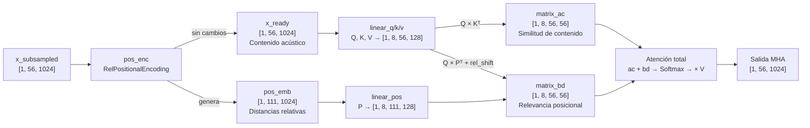
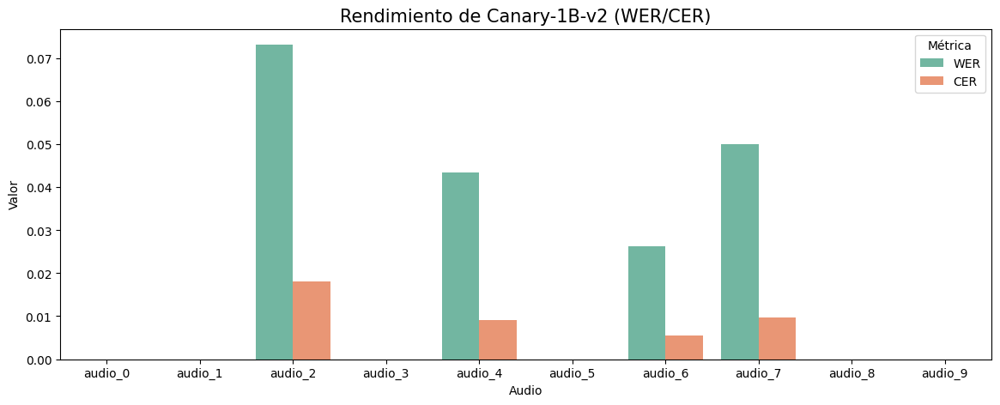

# Inferencia Interactiva con NVIDIA Canary-1B-v2

## 1. Resumen (Abstract)
Este proyecto documenta el análisis y la implementación práctica del modelo multilingüe **Canary-1B-v2** creado por NVIDIA para tareas secuenciales de Reconocimiento Automático del Habla (ASR) y Traducción de Voz a Texto (S2T). El presente trabajo aborda desde el entendimiento de la arquitectura hasta el despliegue de una interfaz gráfica de usuario en `Streamlit` para aplicar inferencia interactiva en audios locales. Adicionalmente, se consolida una evaluación cuantitativa del modelo utilizando métricas de error de transcripción y de caracteres (WER/CER).

## 2. Introducción
El constante avance en el procesamiento de datos secuenciales ha impulsado el desarrollo de modelos fundacionales cada vez más robustos para tareas relacionadas con el habla. En este contexto, el presente trabajo se fundamenta en el modelo descrito en el artículo *"CANARY-1B-V2 & PARAKEET-TDT-0.6B-V3: EFFICIENT AND HIGH-PERFORMANCE MODELS FOR MULTILINGUAL ASR AND AST"* [[arXiv]](https://arxiv.org/pdf/2509.14128). 

Este proyecto surge de la necesidad de comprender en profundidad la arquitectura Transformer encoder–decoder aplicada al procesamiento de señales de audio con el **objetivo** de analizar sus componentes principales, examinar de manera detallada los mecanismos de atención, identificar las principales innovaciones introducidas por el modelo y evaluar su desempeño en tareas de reconocimiento del habla.

## 3. Marco teórico
La arquitectura del modelo Canary se sostiene sobre varios avances claves:
*   **Arquitectura Transformer:** El modelo se fundamenta en los Transformers, diseñados para procesar dependencias de largo alcance en flujos secuenciales reemplazando las antiguas redes Recurrentes (RNN).

*   **Mecanismo de Atención (Cross-Attention & Self-Attention):** Permite al modelo "prestar atención" dinámicamente a las partes más relevantes de un espectrograma o frase mientras genera el texto resultante de salida, logrando traducciones más correctas.

*   **FastConformer Encoder:** Es una evolución del Conformer optimizada explícitamente para la eficiencia computacional en tareas de voz. Sus mejoras principales incluyen:

    * **Submuestreo Agresivo (8x):** Reduce la longitud de la secuencia de entrada por un factor de 8 mediante bloques convolucionales, disminuyendo el costo computacional sin perder precisión.
    * **Convoluciones Profundas Separables:** Reemplazan las convoluciones estándar tanto en las capas de submuestreo como en los bloques Conformer, reduciendo el número de operaciones.
    * **Módulos Convolucionales Ligeros:** El tamaño del kernel se reduce (de 31 a 9) y las dimensiones de los canales se escalan hacia abajo, agilizando el codificador sin degradar la calidad del reconocimiento.

## 4. Metodología

Para la experimentación se usaron PyTorch y `nemo.collections.asr`. El análisis pedagógico se desarrolla íntegramente en el cuaderno `canary-1b-v2.ipynb` siguiendo los pasos detallados a continuación.

### 4.1 Carga e inspección del modelo

El modelo se instancia con `ASRModel.from_pretrained("nvidia/canary-1b-v2")`, lo que descarga ~1B parámetros desde Hugging Face en memoria RAM (FP32). Se incluyó, comentado, una secuencia opcional de optimización de memoria:

```python
_CANARY_MODEL_1b_v2 = _CANARY_MODEL_1b_v2.bfloat16()   # Convierte pesos a bfloat16 (mitad de memoria)
_CANARY_MODEL_1b_v2 = _CANARY_MODEL_1b_v2.to('cuda')   # Transfiere el modelo a GPU
```

Luego se inspeccionó el árbol de módulos, revelando la jerarquía completa: `AudioToMelSpectrogramPreprocessor → ConformerEncoder (32 capas) → TransformerDecoderNM (8 bloques) → TokenClassifier`. La configuración del encoder también se inspeccionó, confirmando parámetros clave como `n_layers=32`, `d_model=1024`, `n_heads=8`, `subsampling_factor=8` y `conv_kernel_size=9`.

### 4.2 Pre-procesamiento acústico (`AudioToMelSpectrogramPreprocessor`)

Se cargó un audio real (`Grabacion.m4a`) con `librosa.load(sr=16000)`. Esta señal se pasó manualmente por el `preprocessor` del modelo para generar el espectrograma Mel.

### 4.3 Submuestreo agresivo 8× (`ConvSubsampling`)

Se extrajo y ejecutó el módulo `encoder.pre_encode` de forma aislada para simular paso a paso la reducción de dimensionalidad:

| Etapa | Shape | Descripción |
| :--- | :--- | :--- |
| Entrada al submuestreo | `[1, 444, 128]` | `[B, T, Mels]` — contenido acústico |
| Tras tres Conv2d (`stride=2`) | `[1, 256, 56, 16]` | El tiempo se divide 8× ($444→56$); los canales crecen a 256 |
| Aplanado | `[1, 56, 4096]` | $256 \times 16 = 4096$ rasgos por frame |
| Proyección lineal | `[1, 56, 1024]` | Proyección al espacio latente de 1024 dimensiones (`d_model`) |

El factor 8× reduce el costo de la Auto-Atención (que crece $O(T^2)$).

### 4.4 Codificación posicional relativa (`RelPositionalEncoding`)

Se inspeccionó el módulo `encoder.pos_enc`. A diferencia de los Transformers estándar, que suman un único embedding de posición absoluta al tensor de entrada, el FastConformer mantiene dos flujos paralelos: el contenido acústico `x_ready` pasa **sin modificación**, mientras que en paralelo se construye una matriz `pos_emb` de forma `[1, 111, 1024]` que codifica las **distancias relativas** posibles entre cualquier par de cuadros en la secuencia.

La dimensión 111 se deriva directamente de $2T - 1 = 2(56) - 1 = 111$, ya que entre $T = 56$ frames la máxima distancia representable es de $\pm(T-1) = \pm 55$ pasos: un extremo cubre el caso en que el último cuadro mira al primero (−55), y el otro el caso inverso (+55). Ambos tensores viajan separados hacia el mecanismo de atención. Allí, `pos_emb` es proyectado linealmente a través de `linear_pos` (sin sesgo) para producir la matriz $P$ de forma `[1, 8, 111, 128]`; su traspuesta $P^T$ es la que se multiplica por la Query modificada para construir `matrix_bd` (relevancia posicional), mientras que `matrix_ac` captura la similitud de contenido mediante el producto $Q \times K^T$.




### 4.5 Análisis de una capa Conformer (`ConformerLayer`)

Se tomó la capa `encoder.layers[0]` y se trazó su flujo interno completo:

1. **FeedForward 1** — Pre-Net: proyección $1024→4096→1024$ con activación Swish.
2. **Self-Attention con posición relativa** (`RelPositionMultiHeadAttention`) — Se computaron manualmente los tensores `Q`, `K`, `V` de 8 cabezas (dimensión por cabeza: 128). A partir de estos, se construyeron las matrices `matrix_ac` y `matrix_bd` incorporando los sesgos de posición relativa `pos_bias_u` y `pos_bias_v` con el fin de analizar detalladamente la contribución del **contenido** y de la **información posicional** en el mecanismo de atención.
3. **Módulo Convolucional** — `pointwise_conv1` expande a 2048 canales; `depthwise_conv` con kernel 9 aplica convolución causal; `pointwise_conv2` comprime de vuelta a 1024. Cada sub-paso se verificó con tensores reales.
4. **FeedForward 2** — Post-Net: misma estructura que FeedForward 1.

La siguiente tabla muestra el shape del tensor en cada sub-etapa verificada con tensores reales:

| Sub-etapa | Shape | Descripción |
| :--- | :--- | :--- |
| Entrada a la capa | `[1, 56, 1024]` | `[B, T, d_model]` — salida del pos. encoding |
| Q, K, V (linear_q/k/v) | `[1, 56, 1024]` | Tres proyecciones independientes del mismo tensor |
| Q, K, V multi-head | `[1, 8, 56, 128]` | Redimensionado en 8 cabezas × 128 dim/cabeza |
| `matrix_ac` (contenido) | `[1, 8, 56, 56]` | $(Q+u) \times K^T$ — similitud acústica |
| `matrix_bd` antes de `rel_shift` | `[1, 8, 56, 111]` | $(Q+v) \times P^T$ — relevancia posicional ($2T-1$) |
| `matrix_bd` tras `rel_shift` | `[1, 8, 56, 56]` | Alineada al eje $T \times T$ |
| Salida de atención (`linear_out`) | `[1, 56, 1024]` | 8 cabezas re-ensambladas y proyectadas |
| Entrada `pointwise_conv1` | `[1, 56, 1024]` | Post-MHA con residual + LayerNorm |
| Tras `pointwise_conv1` + GLU | `[1, 56, 1024]` | Expansión a 2048 canales y corte a la mitad |
| Tras `depthwise_conv` (kernel=9) | `[1, 56, 1024]` | Filtrado causal local |
| Salida `pointwise_conv2` | `[1, 56, 1024]` | Proyección de salida 1024→1024 |
| Salida final de la capa | `[1, 56, 1024]` | Tras FeedForward 2 + LayerNorm de salida |

La forma `[1, 56, 1024]` se preserva a lo largo de todo el bloque gracias a las conexiones residuales, y esta misma salida es la entrada de la siguiente de las 32 capas Conformer.

### 4.6 Decoder Transformer (`TransformerDecoderNM`)

Se analizó el decoder de 8 bloques. En cada bloque se simularon:
- **Masked Self-Attention** sobre los tokens generados hasta el momento (autoregresión).
- **Cross-Attention** entre las queries del decoder y las keys/values del encoder, fusionando información acústica y lingüística.
- **PositionWiseFF** de proyección $1024→4096→1024$.

Finalmente, se ejecutó una llamada completa a `_CANARY_MODEL_1b_v2.transcribe()` con un audio de prueba.

## 5. Desarrollo e implementación

1. **Instalación:** Instalar dependencias esenciales utilizando:
   ```bash
   pip install nemo_toolkit[asr] torch torchaudio streamlit jiwer pandas
   ```
2. **Carga de Pesos (Weights Loading):** La obtención del modelo se ejecuta a través de `ASRModel.from_pretrained("nvidia/canary-1b-v2")`. Interamente, NeMo busca el archivo `.nemo` alojado en Hugging Face, descargando el tokenizador y alrededor de 1 billón de parámetros matemáticos. Para evitar saturación en inferencia, los pesos originales (FP32) se pueden transformar eficientemente a un formato de precisión reducida `bfloat16` antes de asignarse a la memoria de la tarjeta gráfica (`_CANARY_MODEL_1b_v2.to('cuda')`).
3. **Pre-Procesamiento Acústico:** Independiente del tipo de audio introducido (idealmente estandarizado a 16 kHz), el pipeline requiere una señal puramente mono (un solo canal). En la interfaz, este paso crítico está salvaguardado por `ffmpeg` para downmix a 1 canal. Posteriormente, las redes neuronales nunca leen el archivo directo: un `AudioToMelSpectrogramPreprocessor` utiliza ventanas sobre la onda de audio (STFT) para traducirlo a una matriz bidimensional (espectrograma) de 128 bandas de frecuencia Mel, la cual captura matemáticamente la energía acústica a lo largo del tiempo.
4. **Inferencia Interactiva (`app.py`):** Mediante `streamlit run app.py` se interactúa con el modelo. El usuario define la condicionalidad ("Prompts de Tarea": ASR, S2T, idiomas y flag de puntuación). En la inferencia interna, el Encoder (FastConformer) realiza una compresión de `8x` sobre el espectrograma. Luego, el Decoder fusiona estos *embeddings* acústicos comprimidos con los prompts de control, generando una secuencia de tokens (autoregresión) hasta encontrar el token especial de fin y devolviendo la cadena de texto humana final.

## 6. Resultados y análisis

Para evaluar el desempeño del modelo de forma cuantitativa, se ejecutó el notebook `inferencia_y_metricas.ipynb`, el cual procesó 10 audios en español del dataset `facebook/multilingual_librispeech`. Por cada audio se obtuvo la transcripción del modelo y se comparó contra el *ground truth* usando las métricas estándar de ASR: WER y CER.

**Resumen de métricas (10 audios):**

| Métrica | Promedio | Transcripciones exactas |
| :--- | :---: | :---: |
| **WER** | 1.93 % | 6 / 10 (60 %) |
| **CER** | 0.42 % | 6 / 10 (60 %) |

**Análisis de Desempeño (WER y CER):**

El gráfico presenta las dos métricas por audio:
*   **Word Error Rate (WER):** Mide proporciones de inserciones, borrados y sustituciones a nivel de palabra.
*   **Character Error Rate (CER):** Mide con mayor granularidad los errores a nivel de carácter.



### Ejemplos de Inferencia (Audio 2 y Audio 7)

<small>

```
================================================================================
  Audio         : test_audios/audio_2.wav
  Ground truth  : echar fuera la vida y acallar las domésticas cuestiones con el huero fragor de las políticas no hagas caso á los hombres que se juntan y gritan hojas sus gritos son que el viento lleva mientras en silencio su dolor radica
  Raw Prediction: echar fuera la vida y acallar las domésticas cuestiones con el güero fragor de las políticas. No hagas caso a los hombres que se juntan y gritan. Ojas sus gritos son que el viento lleva, mientras en silencio su dolor radica.
  Predicción    : echar fuera la vida y acallar las domésticas cuestiones con el güero fragor de las políticas no hagas caso a los hombres que se juntan y gritan ojas sus gritos son que el viento lleva mientras en silencio su dolor radica
  WER=0.0732  CER=0.0181
================================================================================
  Audio         : test_audios/audio_7.wav
  Ground truth  : tú has muerto en mansedumbre tú con dulzura entregándote á mí en la suprema sumisión de la vida pero él
  Raw Prediction: Tú has muerto en mansedumbre, tú con dulzura, entregándote a mí en la suprema sumisión de la vida. Pero él
  Predicción    : tú has muerto en mansedumbre tú con dulzura entregándote a mí en la suprema sumisión de la vida pero él
  WER=0.0500  CER=0.0097
================================================================================
```

</small>

En 6 de los 10 audios el modelo alcanzó WER = CER = 0 %, es decir, transcripción literalmente exacta frente al *ground truth*. En los 4 audios restantes se observó el siguiente comportamiento:

| Audio | WER | CER | Tipo de error |
| :--- | :---: | :---: | :--- |
| audio_2 | 7.32 % | 1.81 % | Sustitución léxica (*huero→güero*, *hojas→Ojas*) |
| audio_4 | 4.35 % | 0.90 % | Normalización de tilde (*sólo→solo*) |
| audio_6 | 2.63 % | 0.56 % | Inserción de signo de interrogación (`¿`) |
| audio_7 | 5.00 % | 0.97 % | Acento tipográfico antiguo (*á→a*) |

En todos los casos el WER supera con amplitud al CER, lo que indica que el modelo comete errores de **palabra completa plausible** (elige una alternativa fonéticamente cercana), no de carácter aleatorio. Si el CER fuera similar al WER, señalaría alucinación de caracteres — un fallo mucho más grave.

## 7. Conclusiones

*   **Aprendizajes:** La evaluación sobre 10 audios en español mostró que en 6 casos el modelo alcanzó WER = CER = 0 %, sugiriendo un desempeño sólido en habla limpia con vocabulario estándar. En los casos con errores, los fallos fueron principalmente fonético-ortográficos (ej. *huero→güero*, tildes arcaicas), nunca aleatorios: el WER siempre superó al CER, lo que es consistente con el comportamiento esperado de un modelo de lenguaje. Adicionalmente, se evidenció la utilidad del diseño por prompts: el dict `{task, source_lang, target_lang, pnc}` permite alternar entre reconocimiento automático del habla y traducción de voz a texto usando el mismo modelo en tiempo de inferencia.
*   **Limitaciones:** El requerimiento de ~1 B de parámetros implica un consumo de 3-6 GB de VRAM incluso en precisión reducida (bfloat16), limitando el despliegue en hardware de consumo. Adicionalmente, la evaluación se restringió a voz leída en condiciones relativamente limpias; el desempeño en habla espontánea, dialectal o con ruido podría diferir.
*   **Posibles mejoras:** Explorar técnicas de optimización para reducir la huella de memoria del modelo y facilitar su despliegue, aplicar ajuste fino sobre dominios o variedades lingüísticas específicas, y ampliar la evaluación a condiciones de audio más diversas y representativas del uso real.
   
## 8. Referencias
[1] NVIDIA Framework NeMo and Canary Architecture base paper: *ArXiv preprint arXiv:2509.14128v2*, 2025.
[2] "Conformer: Convolution-augmented Transformer for Speech Recognition", *Interspeech 2020*.
[3] "FastConformer: Enhancing Conformer for ASR using Subsampling and Lightweight Convolutions", *Interspeech 2023*.
